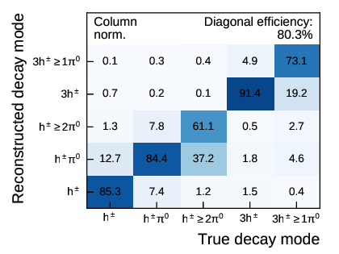

# Tau Decay Mode Classification

The following describes the workflow to train the RNN-based decay mode
classification algorithm for taus.

## Producing MxAOD with THOR

Training the RNN-based decay mode classification requires training samples
produced with THOR. For this a decorator called `DecayModeIDDecorator` from
`tauRecToolsDev` is run inside of THOR that decorates the required variables. A
preconfigured stream called `StreamDecayModeClf` is available in THOR. An
example invokation of THOR is given here: 

```bash
# THOR_SHARE needs to be set to THOR's share directory
thor ${THOR_SHARE}/StreamDecayModeClf/Main.py -r grid \
    -g ${THOR_SHARE}/datasets/MC16DGammatautau.txt \
    --gridstreamname StreamDecayModeClf --gridrunversion 01-00
```

For details on how to use THOR consult the
[documentation](https://gitlab.cern.ch/atlas-perf-tau/THOR/blob/master/README.rst).

## Flattening the MxAOD

After downloading the samples with `rucio` in the directory `${STREAM_DIR}`
(should contain a subdirectory for the Gammatautau sample) the MxAOD flattening
can be run with:

```bash
# Set up environment variables
source rnn-tauid/setup.sh

# Compile the EventLoop algorithms (only if not done beforehand or EventLoop
# algs were changed)
setup_eventloop.sh

# Activate the EventLoop enviroment for the current shell
source activate_eventloop_env.sh

# Run the flattening (output: Gammatautau.root, Gammatautau_1.root, etc.)
RunNtupleCreator.py --decaymodeclf --truth \
    ${STREAM_DIR}/ "*Gammatautau*" -o Gammatautau.root
```

## Converting to HDF5 for Training

After creating flat ntuples from the MxAOD they have to be further converted
into HDF5 format for convenient processing in python. This step requires ROOT
and root_numpy to read the ntuples. As a result a CVMFS-enabled machine is
required for this step. Alternatively you can use your own python setup as long
as all requirements are fulfilled.

To convert the ntuples execute the following in a clean shell:

```bash
# Set up environment variables
source rnn-tauid/setup.sh

# Create python environment and install necessary packages
setup_python.sh

# Activate python environment
source activate_python_env.sh

# Convert ntuple to hdf5
SEL="(TauJets.truthDecayMode < 5) && (TauJets.pt < 100000) && (TauJets.truthPtVis < 100000)"
TRAIN_SEL="(TauJets.mcEventNumber % 2 == 0) && ${SEL}"
TEST_SEL="(TauJets.mcEventNumber % 2 == 1) && ${SEL}"

# A running index is given by '%d' to split files
ntuple2hdf.py gammatautau_train_%d.h5 truthXp ${NTUPLE_DIR}/Gammatautau*.root \
    --decaymodeclf --treename tree --sel "${TRAIN_SEL}"

ntuple2hdf.py gammatautau_test_%d.h5 truthXp ${NTUPLE_DIR}/Gammatautau*.root \
    --decaymodeclf --treename tree --sel "${TEST_SEL}"
```

This applies a basic tau selection for decay mode classification and splits the
dataset into a training and testing part according to the `mcEventNumber`.

## Model Training

The model training can be performed in a standalone python environment (no CVMFS
required). Training the default setup can be done with:

```bash
train_decaymodeclf.py gammatautau_train_%d.h5
```

The training process generates two output files `model.h5` and `preproc.h5`
containing the model weights / architecture and the preprocessing rules for the
input variables. These two files fully define the network and can be used for
evaluation at a later stage.


## Model Evaluation

Assuming you have trained a model and saved the network and preprocessing as
`model.h5` and `preproc.h5` the next step is evaluating the algorithm on
validation or testing data. This can be done with a single command (assuming the
python environment is set up):

```bash
# Evaluate on training data
decorate_decaymodeclf.py ${MODEL_DIR}/preproc.h5 ${MODEL_DIR}/model.h5 \
    ${DATA_DIR}/gammatautau_train_%d.h5 -o deco_train.h5

# Evaluate on testing data
decorate_decaymodeclf.py ${MODEL_DIR}/preproc.h5 ${MODEL_DIR}/model.h5 \
    ${DATA_DIR}/gammatautau_test_%d.h5 -o deco_test.h5
```

This will create an output datafile containing the five decay mode probabilities
returned by the classifier.

After this is done the key performance metrics can be computed. An example is
the migration matrix between decay modes. A plotting script is available and can
be used by calling:

```bash
# Migration matrix (columns are normalized):
plot_migration_matrix.py ${DATA_DIR}/gammatautau_test_%d.h5 deco_test.h5 mig_mat.pdf

# Composition matrix (rows are normalized):
plot_migration_matrix.py ${DATA_DIR}/gammatautau_test_%d.h5 deco_test.h5 comp_mat.pdf \
    --composition
```

An exemplary migration matrix is shown in the following:


## Converting the Model for tauRecTools

To convert the model into a form that is suitable to run in the tauRecTool used
to evaluate the model in the ATLAS software framework a clean shell is required.
This is because `lwtnn`, which is used to evaluate the networks in C++, is only
available for python3, while most of the ATLAS infrastructure runs on python2.
To activate the python3 environment and convert the model do this:

```bash
source rnn-tauid/setup.sh

# 
source activate_lwtnn_env.sh

# Split the model file returned by training into architecture.json and weights.h5
lwtnn-split-keras-network.py model.h5

# Fill the lwtnn variable specification
kerasfunc2json.py architecture.json weights.h5 \
   | fill-lwtnn-varspec-decaymodeclf.py preproc.h5 \
   | kerasfunc2json.py architecture.json weights.h5 /dev/stdin > decaymodeclf_nn.json
```

A quick explanation of the different parts of the conversion:

- `lwtnn-split-keras-network.py` splits the output of the training into a
  `json` file describing the model architecture and a HDF5 file that contains
  the weights of the different layers.

- The first invocation of `kerasfunc2json.py` writes an input variable
  specification to stdout. This description has to be configured with the names
  of the variables, layer names, and offset and scales that are used by the
  usual preprocessing.

- The variable description can be automatically filled using
  `fill-lwtnn-varspec-decaymodeclf.py`. The preprocessing offsets and scales as
  well as variable names are taken from the preprocessing output of the training.

- Finally, lwtnn compiles the (filled) variable specification, architecture and
  weights of the network into a single json representation which can be used in
  `DecayModeClassifier`.

A template for running the decay mode classifier in THOR can be found in
`THOR/share/StreamDecayModeClf`. If the trained and converted model is placed in
`tauRecTools/share`, then the model can be evaluated in THOR by scheduling the
`DecayModeClassifier` and setting its properties. An example is:

```python
# Evaluator for decay mode classification network
Clf = ROOT.tauRecToolsDev.DecayModeClassifier("DecayModeClassifier")
CHECK(Clf.setProperty("Weightfile", "tauRecToolsDev/decaymodeclf_nn.json"))
CHECK(Clf.setProperty("DecorateProba", True))
Config += Clf
```

This will decorate the decay mode decision as well as all five mode probabilities.
