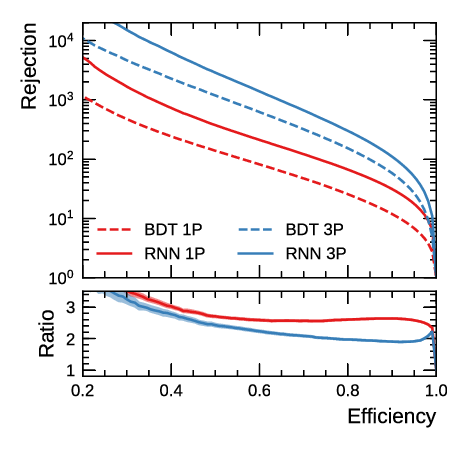

# rnn-tauid

Package to perform training and evaluation of neural networks for tau
identification. You can find the code on
[Gitlab](https://gitlab.cern.ch/cdeutsch/rnn-tauid).



The RNN-based Tau-ID tuning on MC16D was performed with tag v0.1.

## Implementation in Athena

A preliminary implementation of the tau identification RNN trained on MC16A is
available at Tier-0 reconstruction since Athena 21.0.63. This tune has some
problems with the working point flattening and is therefore not recommended to be used.

An updated tune of the RNN (trained on MC16D) is avaiable in special derivations
(p3580, p3581) since AthDerivation 21.2.33.0. A dedicated derivation including
the new tune can be run by specifying
```
from tauRec.tauRecFlags import tauAODFlags; tauAODFlags.doTauIDAODFix=True;
```
as a pre-exec in the derivation production.


